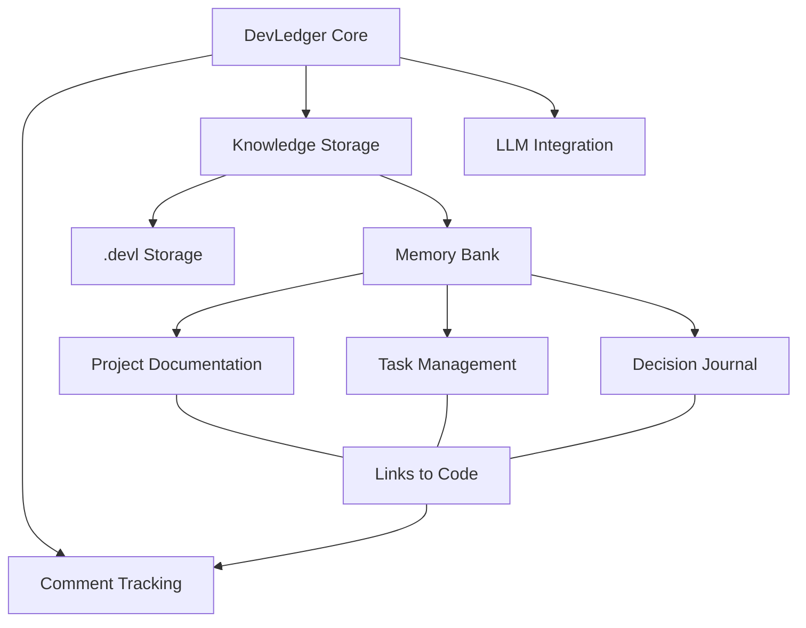
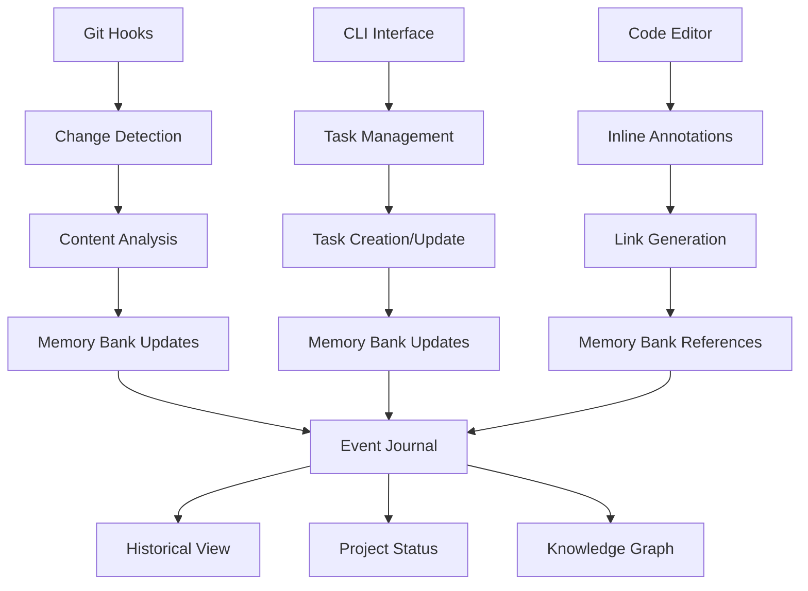
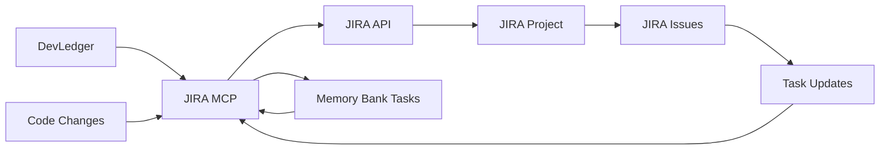
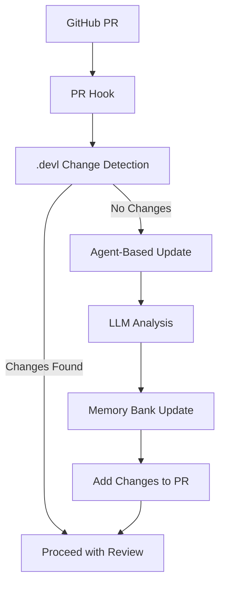

w# Memory Bank Integration Plan for DevLedger

## Executive Summary

This document outlines a comprehensive plan for integrating an enhanced memory bank feature into the DevLedger project. The memory bank will serve as both a historical record of development decisions and a task management system, addressing the dual needs of tracking "what and why things were done" and "planning and managing tasks."

## Critical Analysis of Current Approach

### Strengths & Alignment

1. **Documentation System**: The current memory bank provides excellent structured documentation through markdown files.

2. **Core DevLedger Mission**: Both systems aim to preserve knowledge and context around development decisions.

3. **Complementary Approaches**: 
   - DevLedger: Fine-grained, code-linked comments
   - Memory Bank: Broader architectural and project context

### Critical Gaps & Limitations

1. **Historical Recording Limitations**
   - **Missing Temporal Dimension**: The plan doesn't clearly address how changes are tracked over time
   - **Attribution Gap**: No mechanism for capturing who made decisions and why
   - **Version Correlation**: Unclear relationship between git history and memory bank updates
   - **Decision Evolution**: How changes in approach are documented and reasoned

2. **Task Management Weaknesses**
   - **Workflow Definition**: No clear process for task creation, assignment, and tracking
   - **Priority Management**: Missing system for determining work order
   - **Completion Criteria**: No defined way to mark tasks as complete with evidence
   - **Dependency Tracking**: Inter-task relationships not addressed

3. **Integration Challenges**
   - **Synchronization Issues**: Potential for memory bank to become out of sync with code
   - **Update Triggering**: When and how is memory bank content refreshed?
   - **Boundary Definition**: Unclear separation between code comments and memory bank content
   - **Duplication Risk**: Same information might exist in multiple places

4. **Technical Implementation Concerns**
   - **Performance Impact**: LLM processing during git operations could slow workflows
   - **Conflict Resolution**: How to handle concurrent updates to memory bank files
   - **Storage Efficiency**: Potentially redundant information across systems
   - **Query Complexity**: Searching across both systems might be challenging

## Enhanced Memory Bank Integration Plan

### 1. Dual-Purpose Architecture



### 2. Core Components

#### Historical Record System

1. **Decision Journal**
   - Event-based log capturing key development decisions
   - Includes WHO, WHAT, WHY metadata
   - Temporal markers linking to git commits
   - LLM-assisted summarization of changes

2. **Version Correlation**
   - Memory bank content versioned alongside code
   - Git integration to view documentation at points in time
   - Bidirectional linking between code and documentation
   - Change tracking and history visualization

3. **Attribution Tracking**
   - Developer identification for decisions
   - Context capture explaining rationales
   - References to external influences (issues, discussions)
   - Follow-up annotations for retrospective insights

#### Task Management System

1. **Task Lifecycle Framework**
   - Clear states: Planned → In Progress → Review → Complete
   - Priority assignment and sequencing
   - Dependency mapping between tasks
   - Estimated vs. actual effort tracking

2. **Work Planning Tools**
   - Sprint/milestone planning capabilities
   - Resource allocation and capacity planning
   - Deadline and timeline visualization
   - Automatic progress updates based on git activity

3. **Completion Documentation**
   - Evidence requirements for task completion
   - Automated testing verification links
   - Implementation reference documentation
   - Knowledge capture prompts upon completion

### 3. Integration Architecture



#### Key Integration Points

1. **Git Hook System**
   - Pre-commit hooks for comment extraction
   - Post-commit hooks for memory bank synchronization
   - Merge hooks for conflict resolution
   - LLM-powered suggestion generation

2. **Bidirectional Linking**
   - Code annotations referencing memory bank entries
   - Memory bank entries linking to specific code locations
   - Stable identifiers resilient to code movement
   - Version-aware linking to handle code evolution

3. **Query Interface**
   - Natural language queries across both systems
   - Context-aware search prioritization
   - Time-based filtering of results
   - Multi-dimensional exploration (who, what, why, when)

### 4. Storage Implementation

```
.devl/
  ├── comments/                 # Comment tracking
  │   ├── <file_path>.yaml      # Comment data by file
  │   └── index.yaml            # Global comment index
  │
  ├── memory_bank/              # Memory bank storage
  │   ├── project/              # Project documentation
  │   │   ├── projectbrief.md
  │   │   ├── techContext.md
  │   │   └── ...
  │   │
  │   ├── tasks/                # Task management
  │   │   ├── active/           # Current tasks
  │   │   ├── completed/        # Finished tasks
  │   │   └── index.yaml        # Task metadata
  │   │
  │   ├── journal/              # Decision journal
  │   │   ├── YYYY-MM-DD/       # Entries by date
  │   │   └── index.yaml        # Journal index
  │   │
  │   └── links/                # Bidirectional references
  │       ├── code_to_docs.yaml # Code to documentation links
  │       └── docs_to_code.yaml # Documentation to code links
  │
  ├── vectordb/                # Semantic search
  └── config.yaml              # Configuration
```

### 5. External Integrations

#### JIRA Integration
- JIRA MCP for bidirectional task synchronization
- Task creation and retrieval between systems
- Status synchronization between JIRA and memory bank
- Automated linking between JIRA issues and code changes



#### GitHub Integration
- PR-based hooks to enforce memory bank updates
- GitHub Actions that run agent-based queries
- Automated memory bank updates based on PR content
- Validation checks to ensure documentation completeness



#### CI/CD Pipeline Integration
- Automated documentation generation during builds
- Validation of memory bank consistency
- Test coverage reporting linked to tasks
- Release notes generation from memory bank content

## Implementation Strategy

### Phase 1: Foundation (1 month)
1. **Enhanced Memory Bank Structure**
   - Set up journal-based architecture
   - Implement basic task tracking
   - Create bidirectional linking system
   - Develop versioning approach

2. **Core Integration**
   - Build git hook foundation
   - Create CLI commands for memory bank
   - Implement storage system
   - Set up query interface

### Phase 2: Intelligence Layer (1 month)
1. **LLM Integration**
   - Task suggestion capabilities
   - Journal entry assistance
   - Change summarization
   - Historical context analysis

2. **Knowledge Graph**
   - Entity relationship mapping
   - Decision pathway visualization
   - Impact analysis tooling
   - Dependency tracking

### Phase 3: Workflow Enhancement (1 month)
1. **Task Management**
   - Task board visualizations
   - Dependency management
   - Progress tracking
   - Resource allocation

2. **Historical Analysis**
   - Time-based exploration tools
   - Decision evolution tracking
   - Retrospective capabilities
   - Pattern recognition

### Phase 4: Advanced Capabilities (1 month)
1. **Enterprise Features**
   - Multi-user coordination
   - Access control system
   - Notification framework
   - Integration APIs

2. **Optimization**
   - Performance enhancements
   - Storage efficiency improvements
   - Query optimization
   - UI/UX refinements

## Technical Challenges & Mitigations

### Challenge 1: Developer Friction
- **Risk**: Additional documentation requirements disrupt workflow
- **Mitigation**: 
  - Automate content generation through LLMs
  - Integrate with existing development tools
  - Minimize manual input requirements
  - Provide immediate value feedback
  - Fast and frequent LLM calls with minimal perceived latency
  - Built-in tooling as part of standard development workflow

### Challenge 2: Synchronization
- **Risk**: Memory bank becomes out of sync with codebase
- **Mitigation**:
  - Automated update triggers via git hooks
  - Periodic consistency checks
  - Smart merge conflict resolution
  - Resilient reference system
  - PR validation requiring memory bank updates
  - Agent-based updates for missing documentation

### Challenge 3: Performance Impact
- **Risk**: LLM processing creates workflow delays
- **Mitigation**:
  - Asynchronous processing where possible
  - Tiered approach with lightweight local operations
  - Caching of common operations
  - Configurable processing depth
  - Optimized models for specific tasks

### Challenge 4: Storage Complexity
- **Risk**: Redundant or inconsistent information
- **Mitigation**:
  - Single source of truth principles
  - Reference-based system over duplication
  - Consistent data schemas
  - Validation during updates
  - Optimized storage formats for different content types

## Memory Bank Tracking & Evolution

### Change Tracking Approach
- Leverage Git's built-in history tracking for all `.devl` files
- Attribution of changes (who/when) through git commit metadata
- Additional metadata layer for capturing the "why" behind changes
- Comprehensive comment files with historical context and linked information

### PR and Commit Hooks
- Git hooks to enforce memory bank updates on every PR
- Validation checks to ensure documentation meets quality standards
- GitHub Actions that run agent-based queries to suggest documentation improvements
- Automated agents that enhance documentation based on code changes

### Detailed Documentation Strategy
- Longer, more thorough comments in memory bank files
- Historical rationales behind decisions explicitly captured
- Links between disparate information to create a knowledge graph
- Temporal tagging to track evolution of decisions over time

## Ideas for Future Enhancement

1. **Integration Expansions**
   - JIRA integration for enterprise task management
   - Confluence/Wiki integration for broader documentation
   - Slack/Teams integration for discussion capture
   - IDE plugins for inline memory bank access

2. **Advanced Intelligence**
   - Predictive task estimation based on historical data
   - Automatic detection of knowledge gaps
   - Proactive suggestion of documentation improvements
   - Cross-project knowledge transfer

3. **Visualization Layer**
   - Interactive knowledge graph visualization
   - Decision tree exploration tools
   - Timeline-based project evolution view
   - Impact analysis visualization

4. **Collaboration Enhancements**
   - Real-time collaborative editing
   - Comment and annotation system
   - Knowledge contribution metrics
   - Expert identification based on contribution patterns

5. **Automation Opportunities**
   - Automatic documentation generation from code
   - Meeting transcription to knowledge capture
   - Voice interface for knowledge queries
   - Periodic knowledge health assessment

## Success Criteria

1. **Historical Tracking**
   - Complete decision history is maintained
   - Context for all major decisions is preserved
   - Attribution is clear and accurate
   - Evolution of approaches is documented

2. **Task Management**
   - All work is tracked from concept to completion
   - Dependencies and priorities are managed effectively
   - Progress is visible and automatically updated
   - Completion criteria are well-defined and verified

3. **Developer Experience**
   - System integrates seamlessly with existing workflow
   - Documentation burden is minimized
   - Value is apparent and immediate
   - Learning curve is reasonable

4. **Knowledge Preservation**
   - Critical context is not lost over time
   - New team members can quickly understand decisions
   - Historical questions can be answered accurately
   - Knowledge transfer is efficient

## Conclusion

This enhanced memory bank integration plan addresses both the historical record needs and task management requirements for the DevLedger project. By implementing a comprehensive system that tracks decisions over time while managing ongoing and future work, we can create a robust knowledge management system that preserves critical context and facilitates efficient development processes.

The plan overcomes the limitations of the current approach while building on its strengths, resulting in a tightly integrated system that provides substantial value with minimal developer friction. By leveraging Git's native history tracking, implementing strategic hooks and automation, and focusing on developer experience, we can ensure that the memory bank becomes an integral and valuable part of the development workflow.