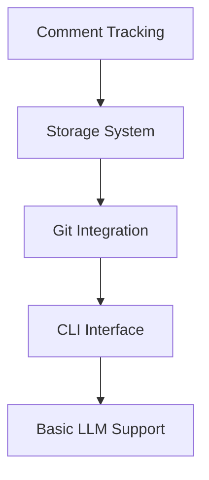

# Active Context

## Current Focus
We are initiating the DevLedger project, focusing on establishing the core infrastructure and basic functionality for version 0.1.0.

## Recent Decisions

### 1. Project Structure
- Created memory bank for project documentation
- Established core architectural patterns
- Defined initial technology stack
- Outlined phased development approach

### 2. Technical Choices
- Python 3.8+ as base language
- JSON/YAML for knowledge storage
- Git-based tracking system
- Support for both local and cloud LLMs

### 3. Implementation Strategy
- Starting with core comment tracking
- Building minimal viable CLI
- Implementing basic git hooks
- Setting up essential storage structure

## Active Considerations

### 1. Core Components

### 2. Immediate Priorities
1. Set up project structure
2. Implement basic comment parsing
3. Create storage system
4. Build CLI foundation
5. Add git hook integration

### 3. Open Questions
- Best approach for pattern matching performance
- Storage format optimization strategy
- LLM integration architecture
- Testing methodology

## Next Steps

### 1. Development Setup
- [ ] Create project structure
- [ ] Set up development environment
- [ ] Configure testing framework
- [ ] Establish CI/CD pipeline

### 2. Core Implementation
- [ ] Build comment parser
- [ ] Implement storage system
- [ ] Create git hooks
- [ ] Develop basic CLI

### 3. Documentation
- [ ] API documentation
- [ ] Usage examples
- [ ] Development guide
- [ ] Contribution guidelines

## Current Insights

### 1. Technical Patterns
- Focus on modularity for extensibility
- Prioritize performance in core operations
- Design for future hardware integration
- Plan for scalability

### 2. Development Approach
- Iterative implementation
- Regular testing milestones
- Documentation-driven development
- User feedback integration

### 3. Risk Management
- Performance monitoring
- Error handling strategy
- Fallback mechanisms
- Data integrity assurance

## Project Health

### 1. Current Status
- Initial setup phase
- Core architecture defined
- Development planning
- Team alignment

### 2. Key Metrics
- Project setup: 0%
- Core functionality: 0%
- Documentation: 10%
- Testing coverage: 0%

### 3. Blockers
- None currently identified

### 4. Dependencies
- Python environment
- Git integration
- LLM services (planned)
- Storage backend (planned)

## Immediate Action Items

### This Week
1. Set up project repository structure
2. Create initial package configuration
3. Implement basic comment parsing
4. Begin storage system development

### Next Week
1. Continue core implementation
2. Add basic CLI functionality
3. Begin git hook integration
4. Start testing framework

## Notes and Observations

### Technical
- Need to carefully consider pattern matching performance
- Storage system should be optimized for frequent updates
- Git integration needs robust error handling
- CLI should prioritize user experience

### Process
- Documentation should evolve with implementation
- Testing should be comprehensive from start
- User feedback should guide development
- Performance metrics need monitoring

## Learning Points

### 1. Technical Insights
- Pattern-based tracking complexity
- Storage optimization requirements
- Git integration considerations
- LLM integration challenges

### 2. Process Insights
- Documentation importance
- Testing strategy needs
- User experience focus
- Performance considerations

## Updates Log

### 2025-05-13
- Created memory bank
- Established project structure
- Defined core architecture
- Set initial priorities