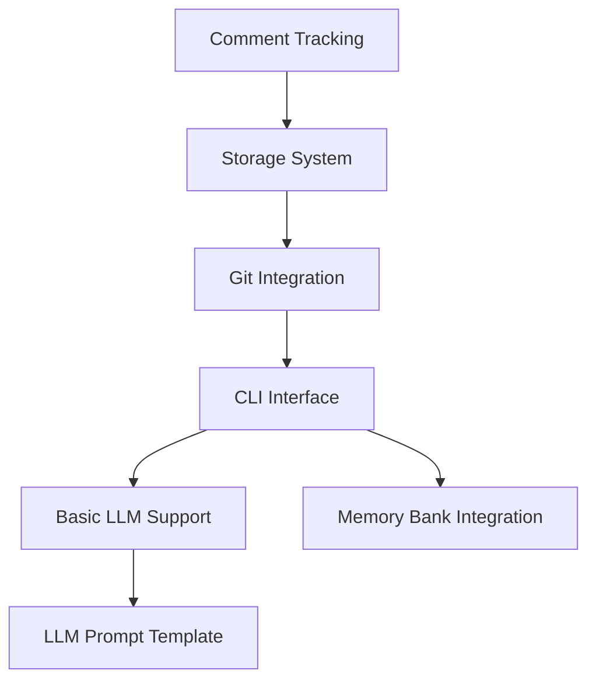

# Active Context

## Current Focus
We are initiating the DevLedger project, focusing on establishing the core infrastructure and basic functionality for version 0.1.0.

## Recent Decisions

### 1. Project Structure
- Created memory bank for project documentation
- Established core architectural patterns
- Defined initial technology stack
- Outlined phased development approach
- Developed comprehensive memory bank integration plan
- Created LLM prompt template for standardized AI interaction with memory bank

### 2. Documentation Enhancements
- Created LLM prompt template to standardize AI interactions with the memory bank
- Improved comment structure with content levels (Debug, Info, etc.)
- Added support for tracking external documentation references in comment files
- Simplified comment metadata requirements

### 2. Technical Choices
- Python 3.8+ as base language
- JSON/YAML for knowledge storage
- Git-based tracking system
- Support for both local and cloud LLMs
- Enhanced memory bank with historical tracking and task management

### 3. Implementation Strategy
- Starting with core comment tracking
- Building minimal viable CLI
- Implementing basic git hooks
- Setting up essential storage structure
- Integrating memory bank with development workflow
- Standardizing LLM interactions with memory bank through prompt template

## Active Considerations

### 1. Core Components

### 2. Immediate Priorities
1. Set up project structure
2. Implement basic comment parsing
3. Create storage system
4. Build CLI foundation
5. Add git hook integration
6. Implement memory bank foundations

### 3. Open Questions
- Best approach for pattern matching performance
- Storage format optimization strategy
- LLM integration architecture
- Testing methodology
- Memory bank synchronization approaches
- LLM prompt template maintenance and evolution
- External system integration (JIRA, GitHub)
- Prompt template maintenance strategy
- Comment structure standardization

## Next Steps

### 1. Development Setup
- [ ] Create project structure
- [ ] Set up development environment
- [ ] Configure testing framework
- [ ] Establish CI/CD pipeline
- [ ] Initialize memory bank structure

### 2. Core Implementation
- [ ] Build comment parser
- [ ] Implement storage system
- [ ] Create git hooks
- [ ] Develop basic CLI
- [ ] Set up memory bank tracking
- [ ] Implement enhanced comment structure

### 3. Documentation
- [ ] API documentation
- [ ] Usage examples
- [ ] Development guide
- [ ] Contribution guidelines
- [x] LLM prompt template documentation
- [ ] Memory bank integration guide
- [ ] Update LLM prompt template with new features
- [ ] Create prompt template maintenance guidelines

## Current Insights

### 1. Technical Patterns
- Focus on modularity for extensibility
- Prioritize performance in core operations
- Design for future hardware integration
- Plan for scalability
- Leverage LLMs for documentation assistance
- Utilize standardized prompt templates for consistent AI interaction

### 2. Development Approach
- Iterative implementation
- Regular testing milestones
- Documentation-driven development
- User feedback integration
- Minimize developer friction

### 3. Risk Management
- Performance monitoring
- Error handling strategy
- Fallback mechanisms
- Data integrity assurance
- Documentation synchronization
- Prompt template version control

## Project Health

### 1. Current Status
- Initial setup phase
- Core architecture defined
- Development planning
- Team alignment
- Memory bank integration planned
- LLM prompt template completed

### 2. Key Metrics
- Project setup: 0%
- Core functionality: 0%
- Documentation: 20%
- Testing coverage: 0%
- Memory bank implementation: 10%

### 3. Blockers
- None currently identified

### 4. Dependencies
- Python environment
- Git integration
- LLM services (planned)
- Storage backend (planned)
- External service integrations (future)

## Immediate Action Items

### This Week
1. Set up project repository structure
2. Create initial package configuration
3. Implement basic comment parsing
4. Begin storage system development
5. Initialize memory bank framework

### Next Week
1. Continue core implementation
2. Add basic CLI functionality
3. Begin git hook integration
4. Start testing framework
5. Develop memory bank storage structure

## Notes and Observations

### Technical
- Need to carefully consider pattern matching performance
- Storage system should be optimized for frequent updates
- Git integration needs robust error handling
- CLI should prioritize user experience
- Memory bank needs efficient change tracking
- LLM prompt template requires periodic review and updates

### Process
- Documentation should evolve with implementation
- Testing should be comprehensive from start
- User feedback should guide development
- Performance metrics need monitoring
- Memory bank updates should be frictionless
- LLM prompt templates should evolve with system capabilities

## Learning Points

### 1. Technical Insights
- Pattern-based tracking complexity
- Storage optimization requirements
- Git integration considerations
- LLM integration challenges
- Standardized prompt template development
- Memory bank synchronization approaches

### 2. Process Insights
- Documentation importance
- Testing strategy needs
- User experience focus
- Performance considerations
- Historical context preservation

## Updates Log

### 2025-05-14
- Developed comprehensive memory bank integration plan
- Enhanced project documentation strategy
- Designed task management approach
- Created external integration concepts
- Developed LLM prompt template for memory bank interaction
- Created LLM prompt template for AI interactions
- Improved comment structure with content levels

### 2025-05-13
- Created memory bank
- Established project structure
- Defined core architecture
- Set initial priorities