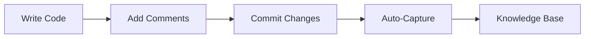
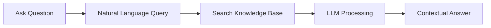

# Product Context

## Problem Space

### Core Challenges
1. **Knowledge Attrition**
   - Critical context lost when team members leave
   - Historical decisions become unclear over time
   - Implementation rationale gets forgotten

2. **Documentation Resistance**
   - Engineers avoid comprehensive documentation
   - Documentation becomes outdated quickly
   - Knowledge capture disrupts workflow

3. **Cross-Domain Fragmentation**
   - Hardware and software knowledge silos
   - Disconnected documentation systems
   - Lost relationships between components

4. **Knowledge Transfer Inefficiency**
   - Time-consuming onboarding processes
   - Repeated explanation of design decisions
   - Difficulty finding relevant information

## Solution Vision

### Core Principles
1. **Minimal Friction**
   - Seamless integration with existing workflows
   - Natural language interaction
   - Automated knowledge capture

2. **Structural Understanding**
   - Code-linked knowledge
   - Hardware-software relationships
   - Pattern-based tracking

3. **Evolution Support**
   - Knowledge grows with the codebase
   - Maintains historical context
   - Adapts to changing requirements

4. **Intelligent Assistance**
   - LLM-powered insights
   - Natural language queries
   - Context-aware suggestions

## User Experience

### Primary Workflows

#### 1. Knowledge Capture

#### 2. Knowledge Retrieval

### User Personas

#### 1. Active Developer
- Needs quick access to implementation details
- Wants to document decisions without disruption
- Requires cross-reference between components

#### 2. New Team Member
- Needs to understand existing codebase
- Wants to learn historical decisions
- Requires guidance on patterns and practices

#### 3. Technical Lead
- Needs system-wide understanding
- Wants to ensure knowledge capture
- Requires oversight of technical decisions

#### 4. Hardware Engineer
- Needs software-hardware interface details
- Wants to document hardware decisions
- Requires cross-domain knowledge access

## Value Proposition

### 1. Time Savings
- Reduced onboarding time
- Faster problem solving
- Efficient knowledge transfer

### 2. Quality Improvement
- Better decision tracking
- Reduced repeated mistakes
- Improved cross-domain understanding

### 3. Risk Reduction
- Preserved critical knowledge
- Reduced dependency on individuals
- Better compliance documentation

### 4. Team Efficiency
- Enhanced collaboration
- Shared understanding
- Faster decision making

## Success Metrics

### 1. Usage Metrics
- Comment coverage
- Query frequency
- Knowledge base growth
- User engagement

### 2. Quality Metrics
- Query success rate
- Knowledge accuracy
- Cross-reference completeness
- User satisfaction

### 3. Business Metrics
- Onboarding time reduction
- Problem resolution speed
- Knowledge retention rate
- Team productivity

## Roadmap Priorities

### Phase 1: Foundation
- Basic comment tracking
- Git integration
- Simple querying
- Core CLI

### Phase 2: Intelligence
- LLM integration
- Advanced queries
- Pattern recognition
- Knowledge synthesis

### Phase 3: Integration
- Hardware support
- Multi-repository
- Advanced visualization
- Team collaboration

### Phase 4: Enhancement
- Advanced analytics
- Custom workflows
- Enterprise features
- Extended integrations

## User Requirements

### Must Have
1. Seamless Git integration
2. Simple comment syntax
3. Fast query response
4. Reliable tracking

### Should Have
1. LLM-powered insights
2. Hardware integration
3. Visual representations
4. Advanced search

### Nice to Have
1. Custom workflows
2. Analytics dashboard
3. Team metrics
4. Integration APIs

## Adoption Strategy

### 1. Individual Developers
- Easy installation
- Quick value demonstration
- Minimal configuration
- Clear documentation

### 2. Development Teams
- Team workflow support
- Knowledge sharing features
- Collaboration tools
- Progress tracking

### 3. Organizations
- Enterprise integration
- Security features
- Custom deployment
- Support options