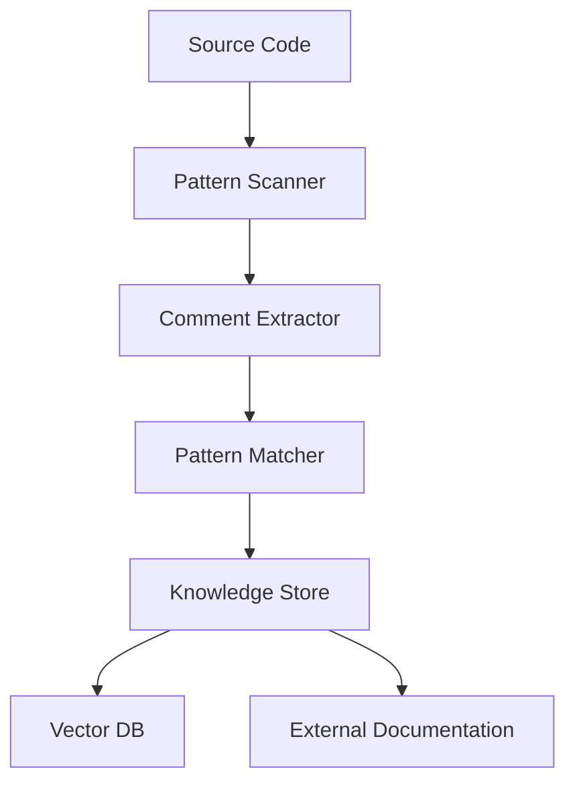

# System Patterns

## Core Design Patterns

### 1. Comment Pattern System
```python
class CommentPattern:
    """Base class for comment pattern recognition and tracking"""
    def __init__(self, id: str):
        self.id = id  # e.g., "5"
        self.content_levels = {
            "Debug": None,
            "Info": None,
            "Link": None
            # Other content levels as needed
        }
```

### 2. Repository Structure
```
devledger/
├── core/
│   ├── patterns/       # Comment pattern matching
│   ├── storage/        # Knowledge storage implementation
│   ├── intelligence/   # LLM integration
│   └── git/           # Git integration
├── cli/               # Command-line interface
├── utils/            # Shared utilities
└── config/           # Configuration management
```

### 3. Command Pattern Implementation
```python
class Command(Protocol):
    """Interface for all CLI commands"""
    def execute(self, context: Context) -> Result:
        """Execute the command with given context"""
        pass
```

## Architectural Patterns

### 1. Plugin Architecture
- Extensible system for language support
- Custom pattern matchers
- Storage backend plugins
- LLM provider integrations
- Prompt template customization
- Memory bank interaction standardization

### 2. Observer Pattern
- Git hook event system
- Comment change notifications
- Knowledge base updates
- LLM processing triggers

### 3. Strategy Pattern
- Configurable comment parsing
- Multiple storage backends
- Different LLM providers
- Pattern matching algorithms
- LLM prompt template variations

### 4. Factory Pattern
- Comment parser creation
- Storage backend instantiation
- LLM client initialization
- Pattern matcher selection
- Content level processing

## Implementation Guidelines

### 1. Code Organization
- Clear separation of concerns
- Interface-based design
- Dependency injection
- Configuration over convention
- Structured comment content

### 2. Error Handling
- Custom exception hierarchy
- Graceful degradation
- Detailed error messages
- Recovery mechanisms

### 3. Testing Strategy
- Unit tests for core components
- Integration tests for workflows
- Property-based testing for patterns
- Mock LLM interactions

### 4. Performance Patterns
- Lazy loading
- Caching strategies
- Batch processing
- Async operations

## Data Flow Patterns

### 1. Comment Processing


### 2. Knowledge Retrieval


### 3. Git Integration


## Best Practices

### 1. Code Style
- Type hints throughout
- Comprehensive docstrings
- Clear naming conventions
- Consistent formatting

### 2. Documentation
- API documentation
- Usage examples
- Architecture diagrams
- Pattern explanations
- LLM prompt templates
- Memory bank interaction guidelines

### 3. Configuration
- Environment-based settings
- Hierarchical config files
- Sensible defaults
- Clear validation

### 4. Versioning
- Semantic versioning
- Migration support
- Backward compatibility
- Feature flags

## Anti-Patterns to Avoid

1. Direct file manipulation without abstraction
2. Tight coupling to specific LLM providers
3. Hardcoded configuration values
4. Synchronous operations for heavy processing
5. Global state
6. Direct database access without repositories
7. Unstructured comment content
8. Ignoring external documentation references

## Evolution Strategy

### 1. Version 0.1
- Basic pattern matching
- Simple storage
- CLI foundations
- Git hook setup
- LLM prompt template foundation

### 2. Version 0.2
- LLM integration
- Vector storage
- Enhanced patterns
- Query capabilities
- Advanced prompt template features

### 3. Version 0.3
- Hardware integration
- Multi-repository support
- Advanced querying
- Performance optimizations