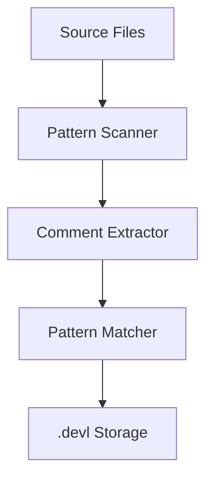
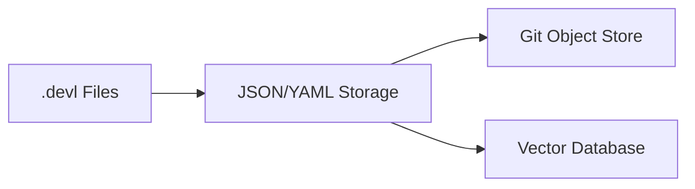
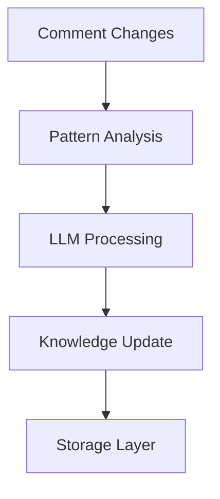

# Technical Context

## Technology Stack

### Core Technologies
- **Language**: Python 3.8+
- **Version Control**: Git 2.25+
- **Storage Format**: JSON/YAML
- **Vector Database**: ChromaDB (planned)

### Dependencies
1. Core (Required)
   - `gitpython`: Git integration
   - `pyyaml`: YAML file handling
   - `click`: CLI interface
   - `rich`: Terminal formatting

2. Intelligence (Optional)
   - `chromadb`: Vector storage
   - `transformers`: Local LLM support
   - `openai`: OpenAI API integration
   - `anthropic`: Anthropic API integration

### Architecture Components

#### 1. Comment Management System

#### 2. Storage Layer

#### 3. Intelligence Pipeline

## Technical Decisions

### 1. Pattern-Based Tracking
- Using regex patterns for comment identification
- Unique IDs based on comment type and sequence
- Git blob hashing for rename resilience

### 2. Storage Strategy
- Parallel `.devl` directory structure
- JSON/YAML for human readability
- Vector embeddings for semantic search
- Git object model for tracking

### 3. LLM Integration
- Support both local and cloud models
- Configurable model selection
- Fallback mechanisms
- Caching for common operations

### 4. API Design
- Command pattern for CLI operations
- Plugin architecture for extensibility
- Event system for hook integration
- Async processing where beneficial

## Development Environment
- Python virtual environments
- Pre-commit hooks
- Type hints and static checking
- Comprehensive test suite

## Performance Considerations
1. Lightweight pattern matching
2. Async LLM operations
3. Caching mechanisms
4. Optimized file I/O
5. Incremental updates

## Security Considerations
1. API key management
2. Local model support
3. Configurable privacy settings
4. Secure storage practices